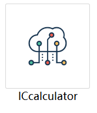
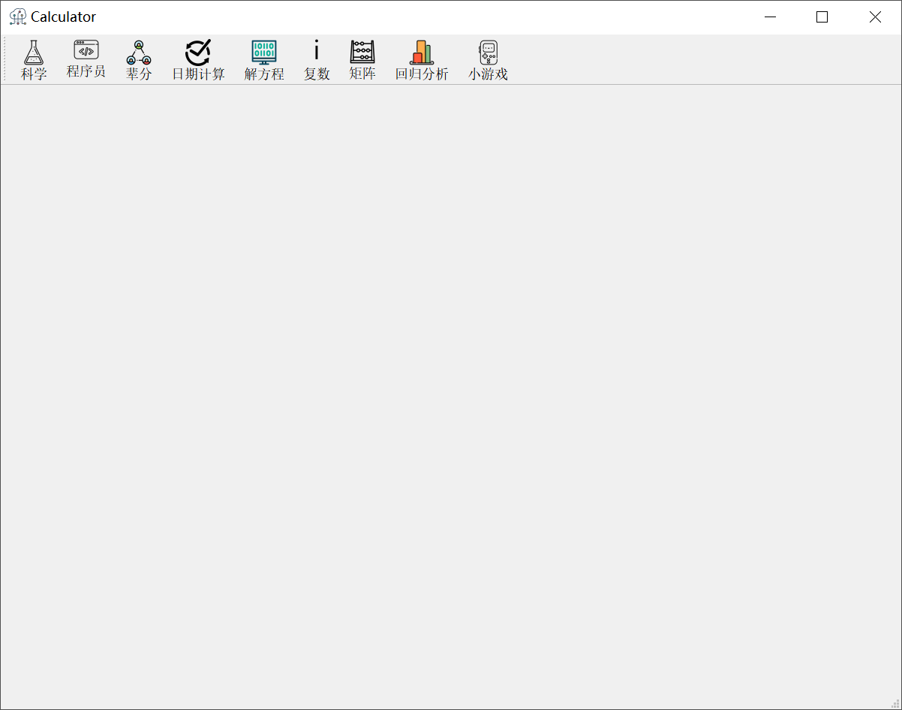
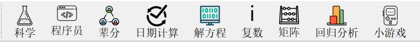
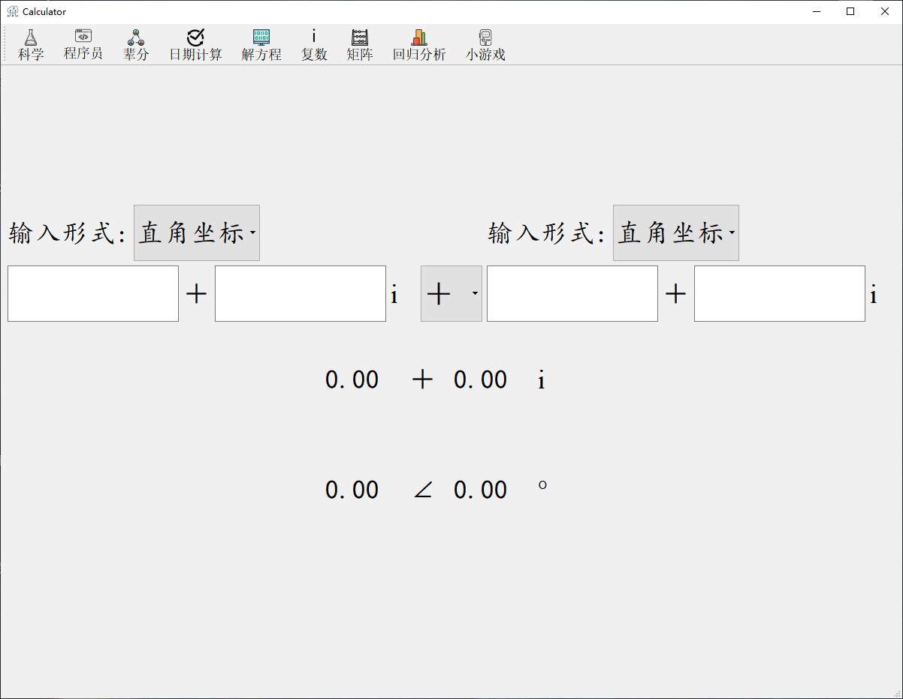
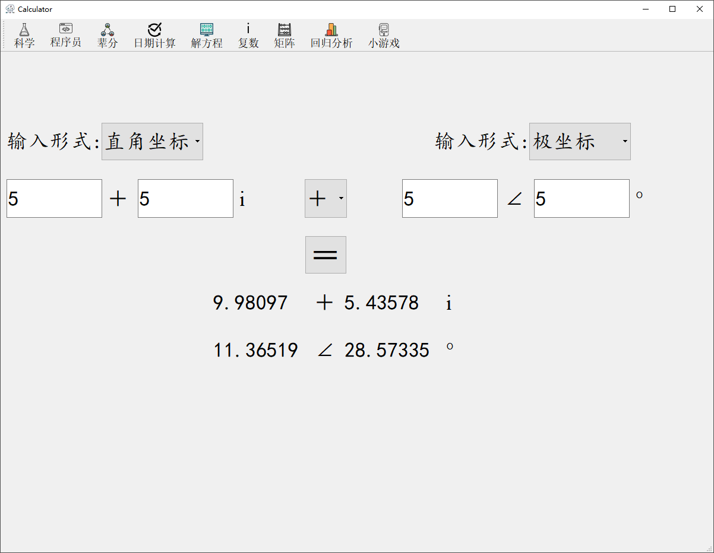

# IC_Calculator
> 使用说明书

<!-- @import "[TOC]" {cmd="toc" depthFrom=2 depthTo=6 OrderedList=false} -->
<!-- code_chunk_output -->

- [打开文件](#打开文件)
- [复数](#复数)
- [矩阵](#矩阵)

<!-- /code_chunk_output -->

## 打开文件

上图就是软件的exe文件，双击即可打开，打开后界面如图

最上面的一行是功能选项，点击想要使用的功能即可

## 复数
下面是复数功能的界面

在输入形式处，你可以选择你的输入形式，分为直角坐标和极坐标两种输入方式，在复选框，你可以选择计算加法、减法、乘法或是除法

最后的两行是计算的结果，以两种形式分别呈现

记住，你做的任何更改，都会引起计算结果的改变

下面是一个演示

## 矩阵