# IC_Calculator
> 使用说明书

<!-- @import "[TOC]" {cmd="toc" depthFrom=2 depthTo=6 OrderedList=false} -->
<!-- code_chunk_output -->

- [打开文件](#打开文件)
- [复数 --谢泰安](#复数-谢泰安)
- [矩阵 --谢泰安](#矩阵-谢泰安)
- [回归分析 --谢泰安](#回归分析-谢泰安)
- [程序员计算器 --钟华麟](#程序员计算器-钟华麟)
- [辈分计算器 --钟华麟](#辈分计算器-钟华麟)
- [小游戏 --钟华麟](#小游戏-钟华麟)
- [科学计算器 --莫文仪](#科学计算器-莫文仪)
- [日期计算器 --莫文仪](#日期计算器-莫文仪)
- [解方程 --莫文仪](#解方程-莫文仪)

<!-- /code_chunk_output -->

## 打开文件

上图就是软件的exe文件，双击即可打开，打开后界面如图

最上面的一行是功能选项，点击想要使用的功能即可

## 复数
下面是复数功能的界面

在输入形式处，你可以选择你的输入形式，分为直角坐标和极坐标两种输入方式，在复选框，你可以选择计算加法、减法、乘法或是除法

最后的两行是计算的结果，以两种形式分别呈现

记住，你做的任何更改，都会引起计算结果的改变

下面是一个演示

## 矩阵
下面是矩阵功能的界面

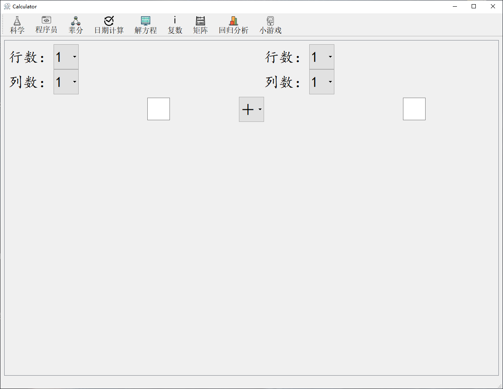

你可以选择行数和列数以及需要进行的计算符号，在这里，你做的任何修改，都会立刻在计算结果上有所响应

此外，任何一个行数或是列数的变换都有可能引起其他行列数的变换，例如将左上角的行数变为三，那么所有行数和列数都会自动变为三，这样方便了使用者切换行列数

下面是演示1

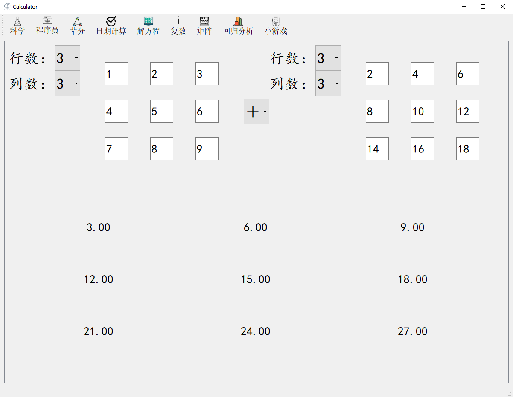

除此之外，系统还会自动保存你已经输入的数据，例如在演示1中的情况，切换左上角行数为4，就会展示下面的演示2的样子

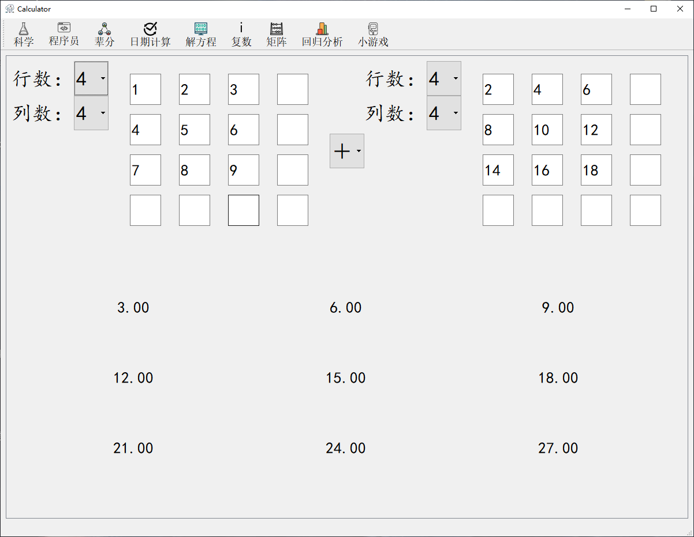

## 回归分析
下面是回归分析功能的界面

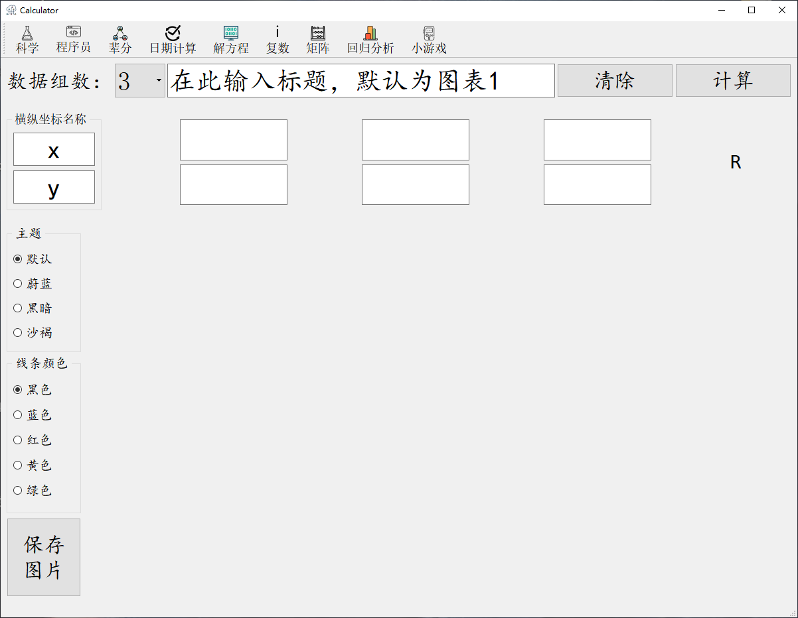

你可以改变数据的组数，展示图象的标题，横纵坐标的名称，甚至是展示图片的主题、线条的颜色

你可以点击保存图片并且选择保存的目录和名称，由此快速的保存生成的图片备用

下面是演示

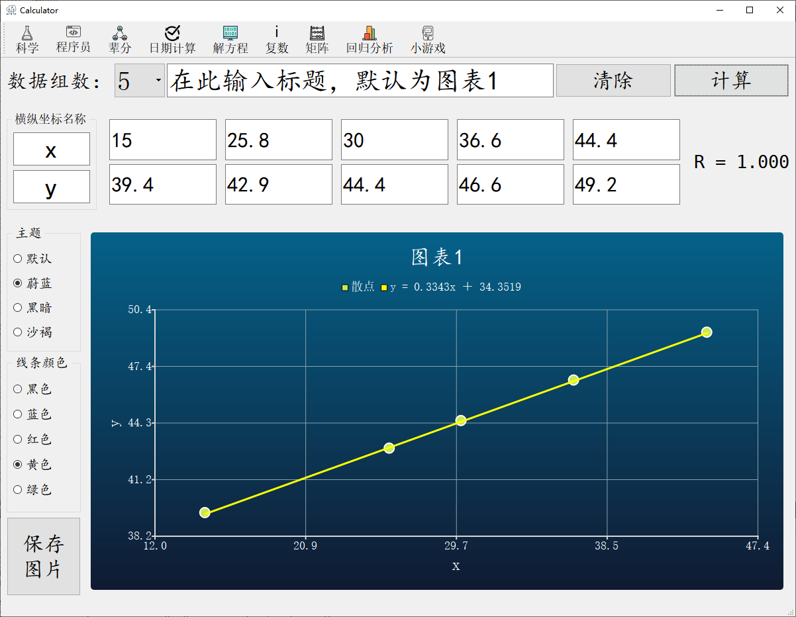

## 程序员计算器
单击“程序员”图标可进入程序员计算器界面。

下面为你展示程序员计算的功能界面。

在复选框你可以选择二进制、八进制、十进制、十六进制四种进制数输入方式，在输入框内输入要转换的对应数字，输出列每行有相应的进制数计算输出对应，输出随着输入的改变实时计算。

下面是一个演示。

## 辈分计算器
单击“辈分”图标可进入亲戚计算器界面。

下面将为你展示亲戚计算的功能界面。

在复选框你可以选择二进制、八进制、十进制、十六进制四种进制数输入方式，在输入框内输入要转换的对应数字，输出列每行有相应的进制数计算输出对应，输出随着输入的改变实时计算。

下面是一个演示。

## 小游戏
单击“小游戏”图标可进入小游戏的功能界面。

下面将为你展示小游戏的功能界面。

在开始界面选择想玩的游戏，然后点击“Start”按钮进入。

下面先介绍“简单算术”小游戏。

进入算术游戏后可看到如下界面。

按“返回”键可返回开始界面重新选择游戏，但已经进行过的游戏进度将不受影响，重新进入该界面可继续游戏。

在输入框中输入该题的答案，输入完毕后按下回车键可判断正误，无论正误都会进入下一轮游戏。左下角的计时器功能如图所示。

下面是一个演示。

下面继续介绍另一个小游戏，24点。

进入24点游戏后可看到如下界面。

按“返回”键可返回开始界面重新选择游戏，但已经进行过的游戏进度将不受影响，重新进入该界面可继续游戏。

题目会在进入游戏后即刻显示，四个输入框用于给用户输入指定题目的数字，三个复选框可选择加减乘除四种计算符号。

==请严正注意==，该24点游戏的数学算式的计算顺序**并不**按照数学逻辑顺序计算，而是按照从左到右的顺序计算算式。例如:`5 – 2 + 1 * 4`的计算顺序是`((( 5 – 2 ) + 1 ) * 4 ) = 24`，而不是`(( 5 – 2 ) + ( 1 * 4 )) = 7`

敬请注意。

下面是一个演示。

## 科学计算器
科学计算器有两个显示区，用户根据计算需要用鼠标点击下方的按钮，最上面显示区就会显示用户当前键入的数据，按下“=”键之后，另一个显示区便会显示结果（该计算器具有判断溢出、输入错误的功能），如图所示

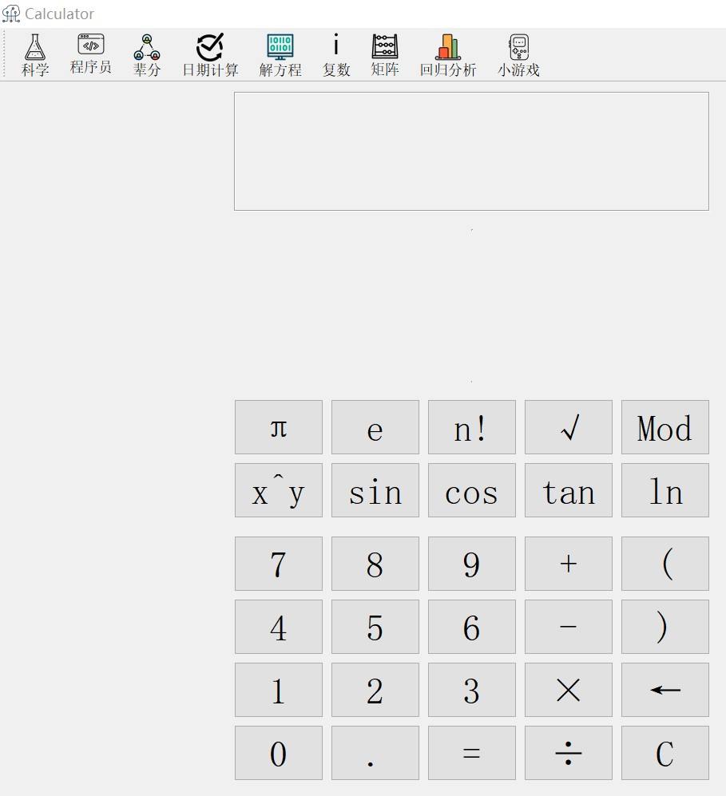

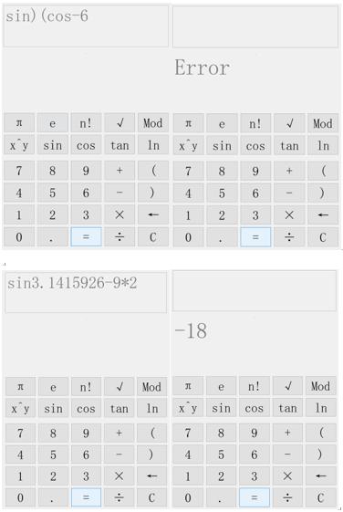

## 日期计算器
日期计算器功能与Windows的计算器一样；通过最上方的下拉列表框可选择进行“日期之间的相隔时间”或“增加或减去天数”运算。

在“日期之间的相隔时间”功能区，用户可以用键盘输入时间，也可以用鼠标点击日期编辑栏的右侧按钮，此时会弹出日历表供用户选择日期，如下图

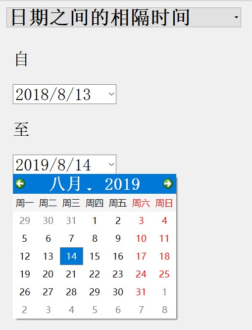

“增加或减去天数”功能如下图所示

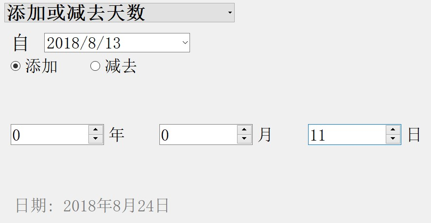

## 解方程
解方程计算器可根据需要选择“一元二次”“一元三次”“二元一次”，键入数据并按下确认键，便可得到结果，如下图。

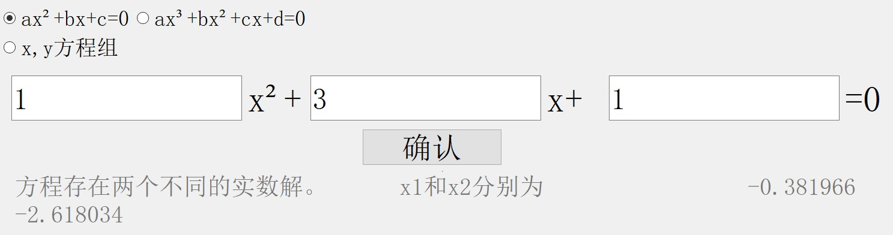
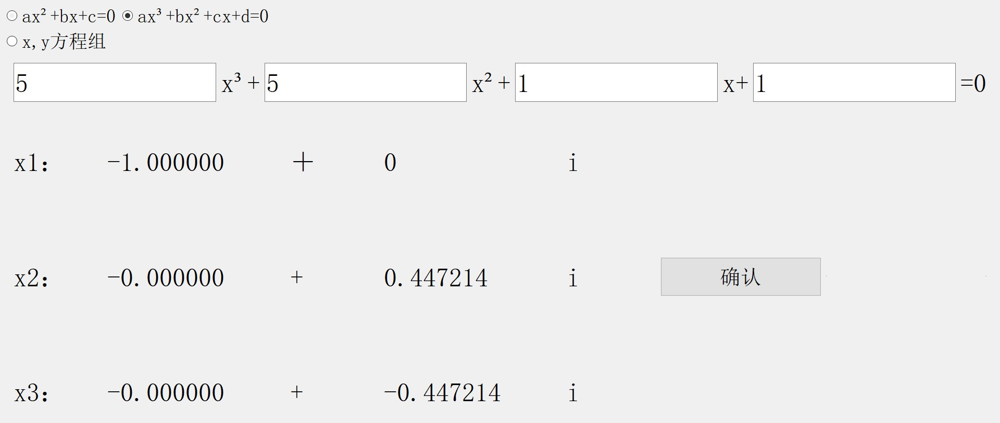
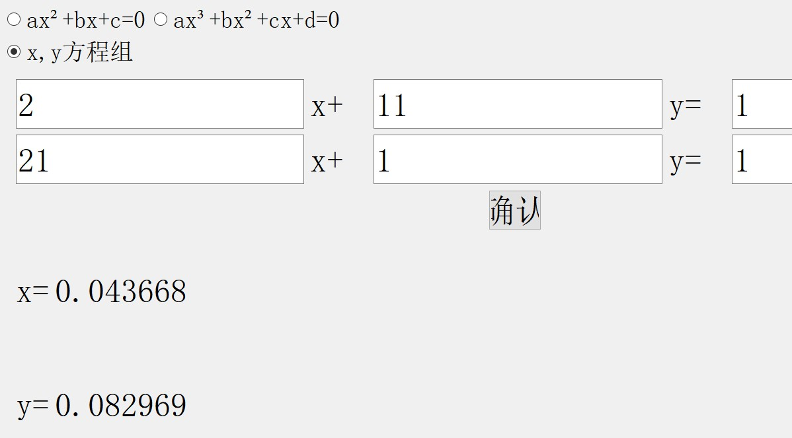